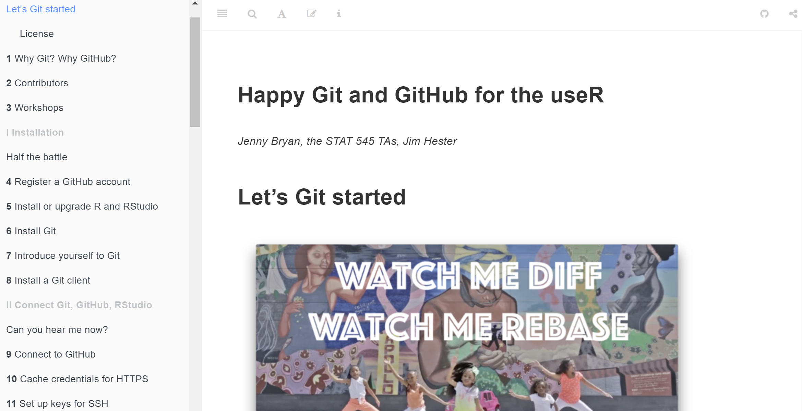

# Building a Personal Website Using Blogdown   
The work in this repository was prepared for [RLadies Pasadena](https://www.meetup.com/rladies-pasadena/).  This repository contains materials helping build a personal website using blogdown.  

<a href="https://bookdown.org/yihui/blogdown"></a>   


## Slides can be found [here](link)
### Overview:  

1. Motivations   

2. Version Control   

3. Blogdown    

4. Get Started   

## Handout  

1. I assume that you have already installed **R** (https://www.r-project.org), the **RStudio** IDE (https://www.rstudio.com).    

2. Set up **git** and connect **RStudio** to **Git** and **Github**. If you haven't already done these, I highly recommend this book: [Happy Git and Github for the useR by Jenny Bryan](https://happygitwithr.com/). 
   

3. Install **blogdown** package in **R**.  

```r
## Install from CRAN
install.packages("blogdown")
## Or, install from GitHub
if (!requireNamespace("devtools")) install.packages("devtools")
devtools::install_github("rstudio/blogdown")
```
4. Install **hugo** in **R**.  *For macOS users, `install_hugo()` uses the package manager Homebrew (https://brew.sh) if it has already been installed, otherwise it just downloads the Hugo binary directly.*

```r
blogdown::install_hugo()
```
Only have to do this once.  

**Please remember which Hugo version you have just downloaded, because the version number will have to be used later for the website deployment.**   

You can check the installed Hugo version via: `blogdown::hugo_version()`

You might want to upgrade hugo occationally: `blogdown::update_hugo()`  


5. Open a new repository in Github, and clone this repository to your local drive, so that you can make modifications in R.  

Take my repo: XUKEREN/KERENXU as an example: 

Click the green button: **Clone or download**, and then copy the link to your clipboard.


Create a new project in RStudio by selecting file &rarr; new project &rarr; version control &rarr; git. Then you will see a window like this:


Fill in the Repository URL with the URL that you just copied from Github.

Please create a directory name. Now you have cloned the project to your local drive.


Select a theme: `blogdown::new_site(theme = "yihui/hugo-xmin")`

Website https://themes.gohugo.io/ offers plenty of choices.


6. Pick a hugo theme  

Here is the website hosting a complete list of hugo themes: https://themes.gohugo.io/. This website offers plenty of choices. 

Pick a theme based on stars and forks of its github repository.   

Take the hugo-academic theme as an example:  

  

Pick a theme base on the date of the last commit on github so that we can know if anyone is actively updating or maintaining it.  

Once you have selected the theme, create a new site by using:  `blogdown::new_site(theme = "yihui/hugo-xmin")` 

When doing this, the local repository must be a completely empty directory except for .Rproj file.  

Then you will find out that there are lots of files in your local repo folder. Make your own changes to these files to personalize your website.    
- config.toml  
- content/  
- static/  
- themes/  
- layouts/  

7. Finally, commit and push your changes to Github.  


