# Building a Personal Website Using Blogdown   

 

The work in this repository was prepared for [RLadies Pasadena](https://www.meetup.com/rladies-pasadena/).  This repository contains materials helping build a personal website using blogdown.  

## [Slides Link](https://xukeren.rbind.io/slides/20191106/slides#1)

## Handout  

### 1. I assume that you have already installed **R** (https://www.r-project.org), the **RStudio** IDE (https://www.rstudio.com).    

### 2. Set up **git** and connect **RStudio** to **Git** and **Github**.   

If you haven't already done these, I highly recommend this book: [Happy Git and Github for the useR by Jenny Bryan](https://happygitwithr.com/). 
  
 

### 3. Install **Blogdown** package in **R**.  

```r
## Install from CRAN
install.packages("blogdown")
## Or, install from GitHub
if (!requireNamespace("devtools")) install.packages("devtools")
devtools::install_github("rstudio/blogdown")
```
### 4. Install **Hugo** in **R**.  

For macOS users, `install_hugo()` uses the package manager Homebrew (https://brew.sh) if it has already been installed, otherwise it just downloads the Hugo binary directly.  


```r
blogdown::install_hugo()
```
Only have to do this once.  

**Please remember which Hugo version you have just downloaded, because the version number will have to be used later for the website deployment.**   

You can check the installed Hugo version via: `blogdown::hugo_version()`

You might want to upgrade hugo occationally: `blogdown::update_hugo()`  


### 5. Open a new repository in Github, and clone this repository to your local drive, so that you can make modifications in R.  

create a new repository:    

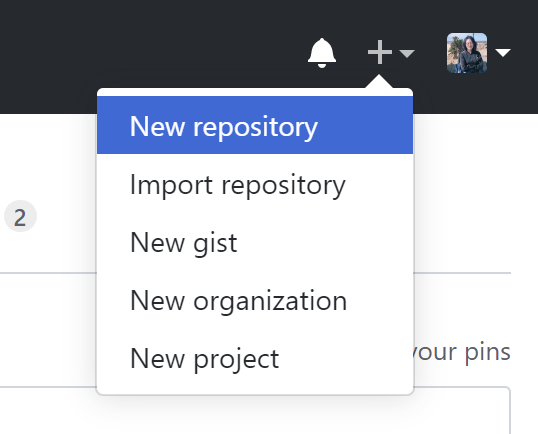 


Take my repo: XUKEREN/KERENXU as an example: 

Click the green button: **Clone or download**, and then copy the link to your clipboard.


Create a new project in RStudio by selecting file &rarr; new project &rarr; version control &rarr; git. Then you will see a window like this:


Fill in the Repository URL with the URL that you just copied from Github.

Please create a directory name. Now you have cloned the project to your local drive.


### 6. Pick a hugo theme.  

Here is the website hosting a complete list of hugo themes: https://themes.gohugo.io/. This website offers plenty of choices. Unless you are an experienced web designer, it's better to start from an existing theme.    

Pick a theme based on stars and forks of its github repository, since more popular themes have more stars and forks.     

Take the hugo-academic theme as an example:  

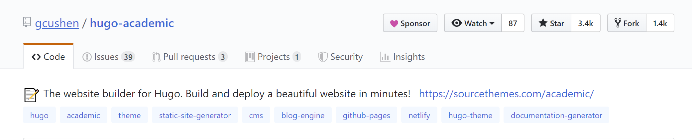 


Pick a theme based on the date of the last commit on github so that we can know if anyone is actively updating or maintaining it.  

Once you have selected the theme, create a new site by using:  `blogdown::new_site(theme = "yihui/hugo-xmin")` - an "e**X**tremely **Min**imal theme"

When doing this, the local repository must be a completely empty directory except for .Rproj file.  

Then you will find out that there are lots of files in your local repo folder (your root directory). Make your own changes to these files to personalize your website.    
- config.toml  
- content/  
- static/  
- themes/  
- layouts/  

### 7. Make your own changes to personalize your website.  

You can use `blogdown:::serve_site()` to preview your changes.  The other way is to use blogdown addin.    

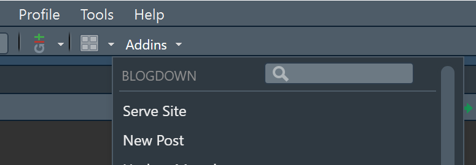     

#### config.toml  
We want to first take a look at the configuration file, a file written in [TOML (Tom's Obvious, Minimal Language) syntaxes](https://github.com/toml-lang/toml). We can change the `baseurl`, `title`, the `navigation menu`, and the links to your `social networks`.     

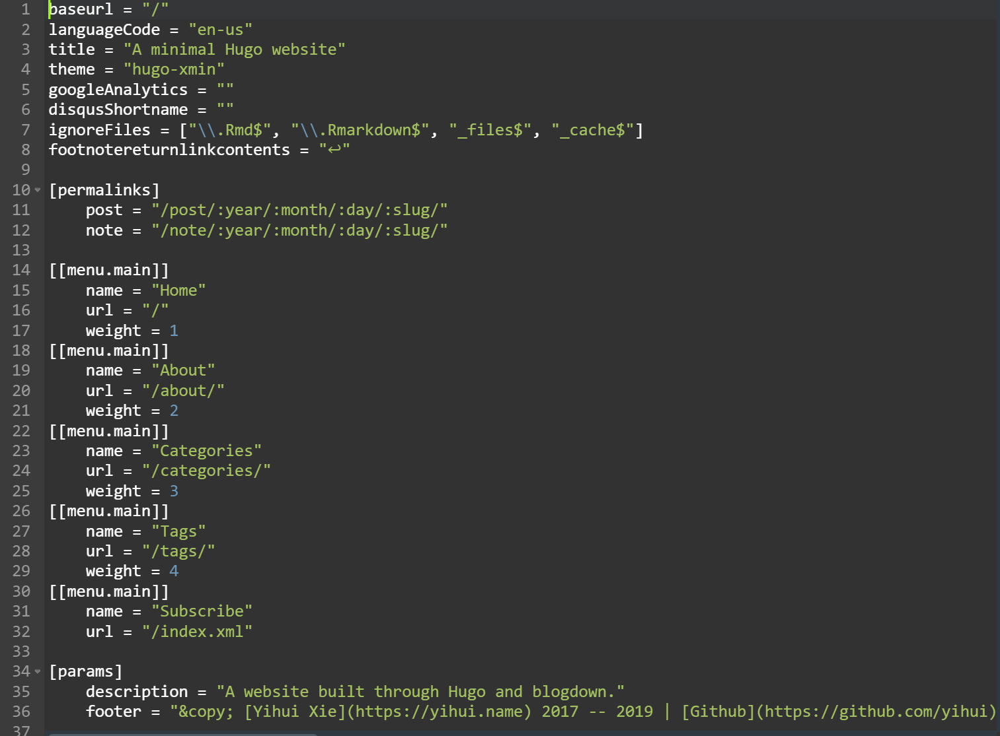  

`[permalinks]` You can find permalinks in a single bracket. This is where you can set the rules to generate permanent links of your pages.  Hugo uses full filenames under content to generate links.  

You can find a folder called post and a folder called note under the content folder.  Once you generate a new post, your post link would be `homepage/post/year/month/day/slug/` and `content/post/year-month-day-slug.md` will be rendered to `public/post/year/month/day/slug/index.html`.  

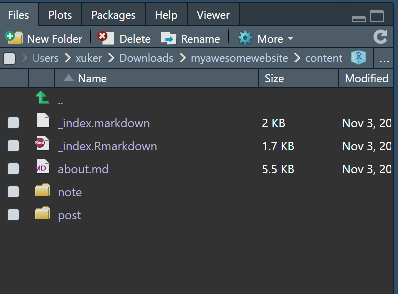

You can also find an `_index.Markdown` file and an `about.md` file here.  The `_index.Markdown` file documents what would show on your homepage. We can open `_index.Markdown` to make some changes.   

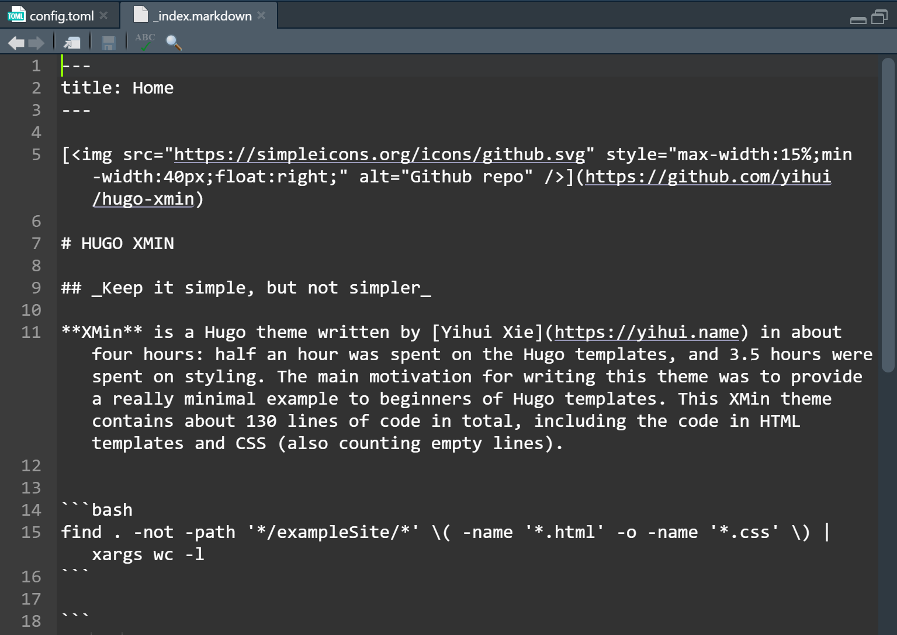  

The `about.md` is on the menu of your main page.   

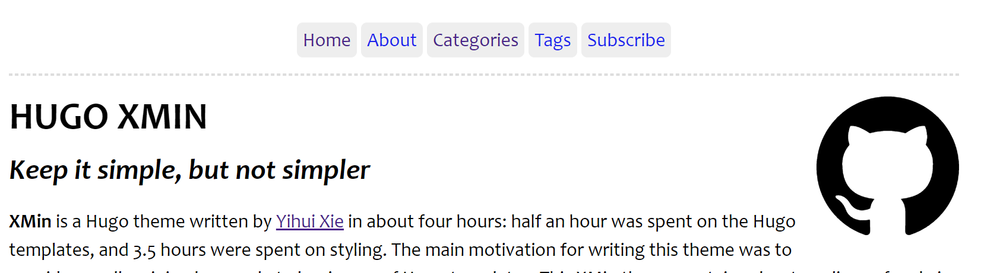    

It was set by values in the double brackets in the `config.toml` file. The actual content of these pages are kept at other location. For example, the `about.md` page was kept in the content folder. We can open `about.md` to make some changes.    
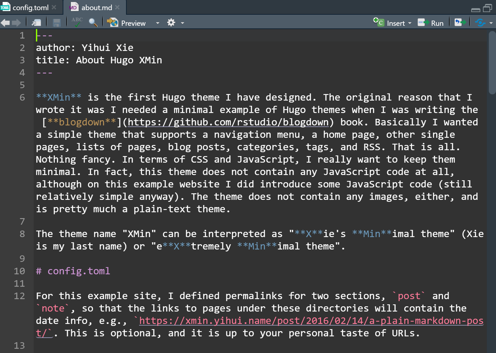   

We can also add more pages in the homepage menue. For example, add a CV option here in the `config.toml`.    

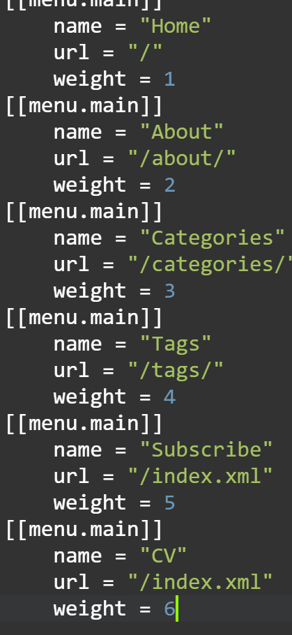   

In addition, do not forget to create a `cv.md` file under the content folder.  
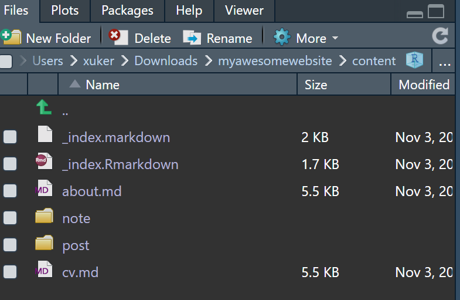   

`enableEmoji`  You can set this option  `= true`  in the `config.toml` so that you can write emojis on your website, like `:dancer:`  Find Emoji cheat sheet [here](https://www.webfx.com/tools/emoji-cheat-sheet/).    


#### Create content   
Create a new post with `blogdown::new_post(title = "my first post")`. You will find a new md file in your content folder. Your post can be written in either R Markdown or plain Markdown.  

Shortcode feature from Hogo: use shortcode to embed twitter content in your post.  

We can use 
```

```
for Markdown file.  

Or use  

```r
blogdown::shortcode('tweet', '1190324101384032257')
```
   
for R Markdown file.  


#### Enable Google Analytics  

If you want to use google analytics to keep tracking your website visitors, add `googleAnalytics = "tracking ID"` in the `config.toml` file and add `{{ template "_internal/google_analytics.html" . }}` in `layouts/partials/foot_custom.html`.          

The tracking ID is a string like UA-000000-2. It must be included in your tracking code to tell Analytics which account and property to send data to.   

Click this [Link](https://support.google.com/analytics/answer/1008080?hl=en) to find out how to set up a Google Analytics Tracking ID.    

#### Add Disquz Comments  

If you want to make your website more interactive by appending visitors' comments to your post, add `disqusShortname = "short name"` in the `config.toml` file and add `{{ template "_internal/disqus.html" . }}` in `layouts/partials/foot_custom.html`.   

Click this [Link](https://help.disqus.com/en/articles/1717111-what-s-a-shortname) to find out how to set up a Disquz short name.  

#### Other features  

Visit `issues` and `pull requests` of the theme's repository to figure out how to embed more features to your website!    


After you make all changes, it is very **important** that you serve the site. 

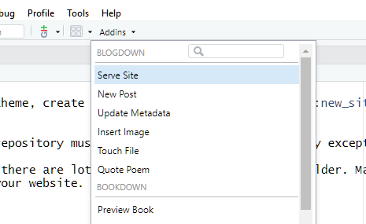  

### 8. Commit and push your changes to Github.   

#### The first way is to use panel options:  

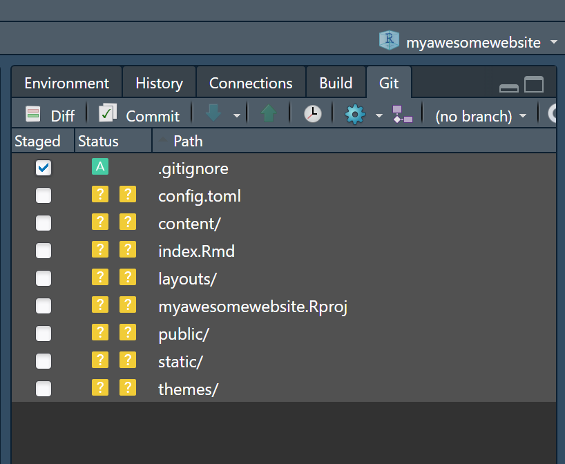   

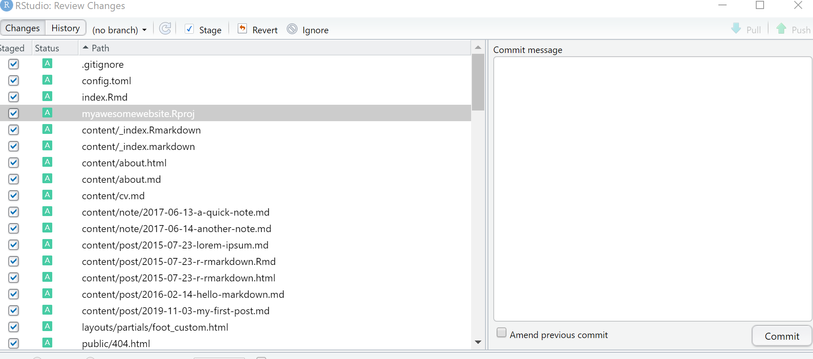   

#### The second way is to go to the terminal in your RStudio   

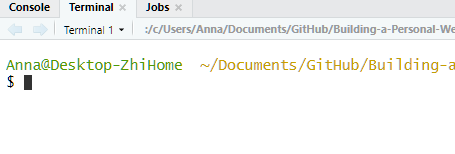

Type `git add .`

Then type `git commit -m "first push"`

Then type `git push`

Now everything in your local computer is on your GitHub repo now. 

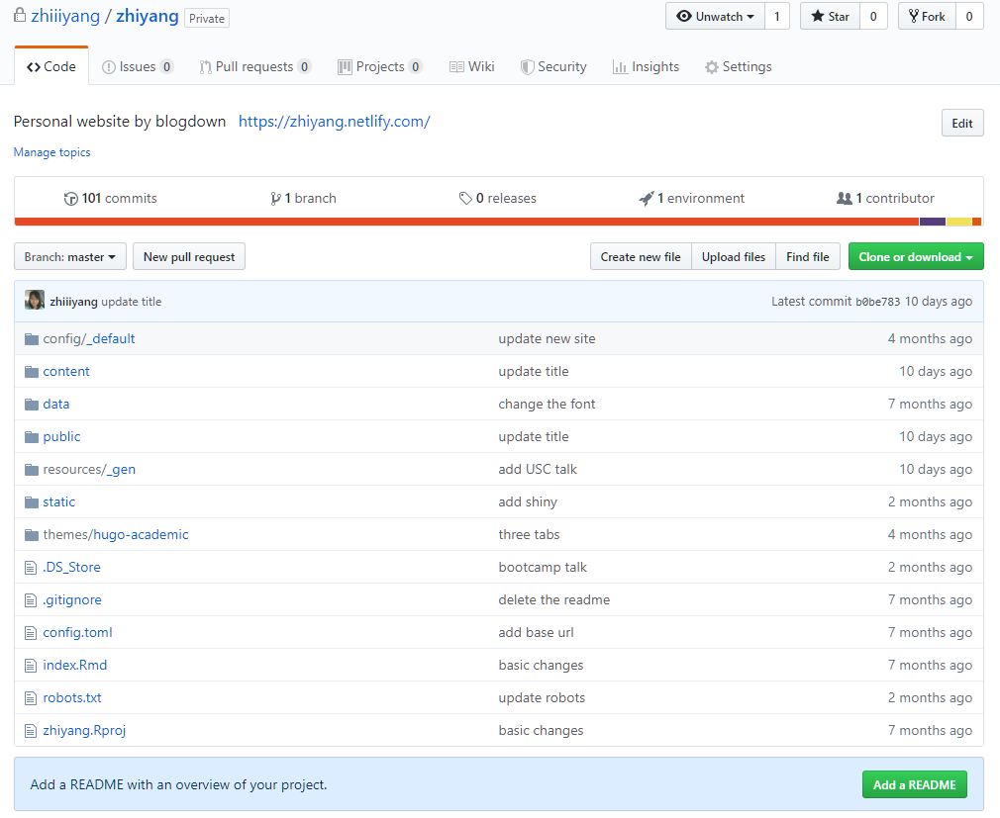

You can make the repo open or private which won't affect the next deployment. 


### 9. Deployment using Netlify.   

Go to the website https://www.netlify.com/

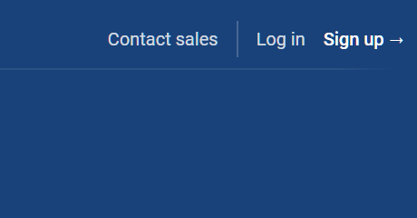

Sign up with your GitHub account

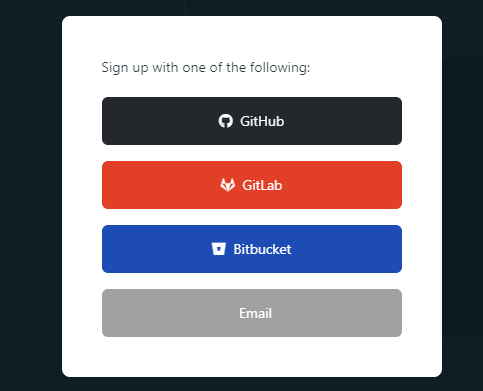

Click "create a new site" and select `GitHub`

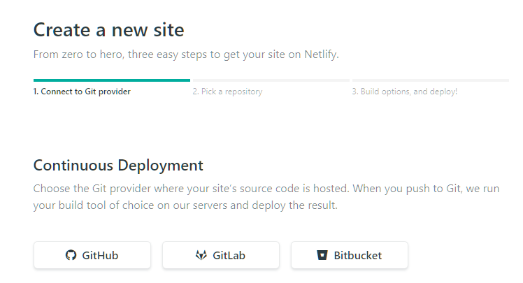  

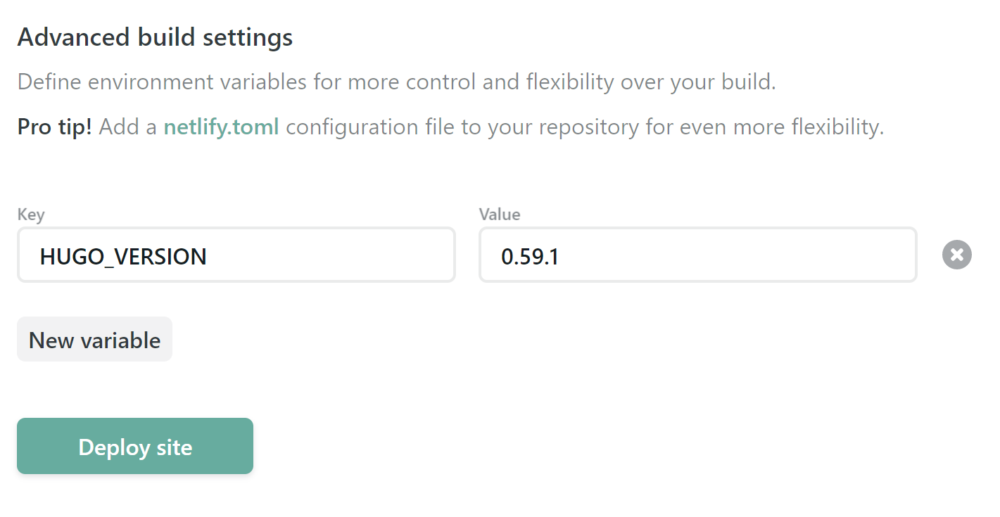   

In Advanced Settings, create New Variable `HUGO_VERSION` = `the hugo version you installed`   

Your website is now deployed. 

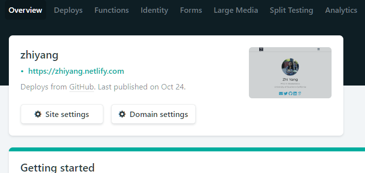

You may change your domain name.

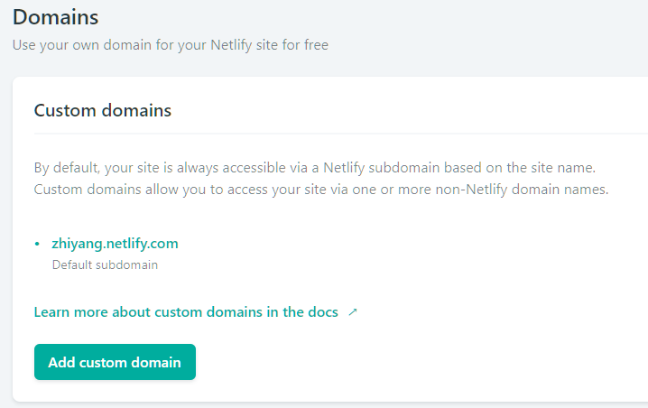  

 
You do not have to keep the netlify.com domain. Rbind can provide you with a free domain name end in rbind.io. See this [Link](https://support.rbind.io/about/) to find out how to apply.  

    

## More resources 

RStudio summer internship project: building a website using `blogdown`

https://summer-of-blogdown.netlify.com/


