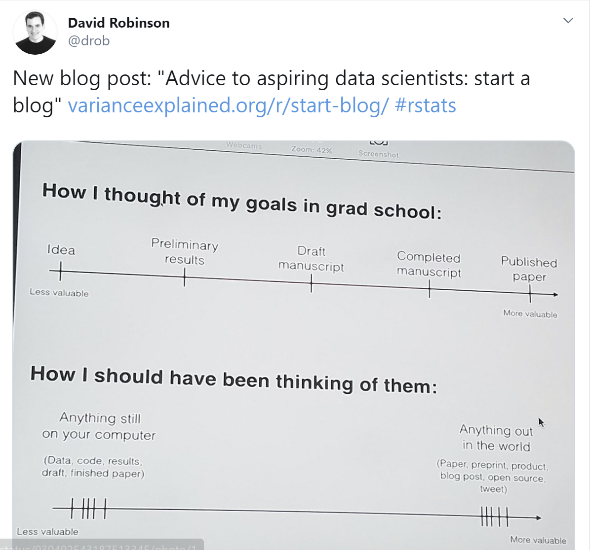
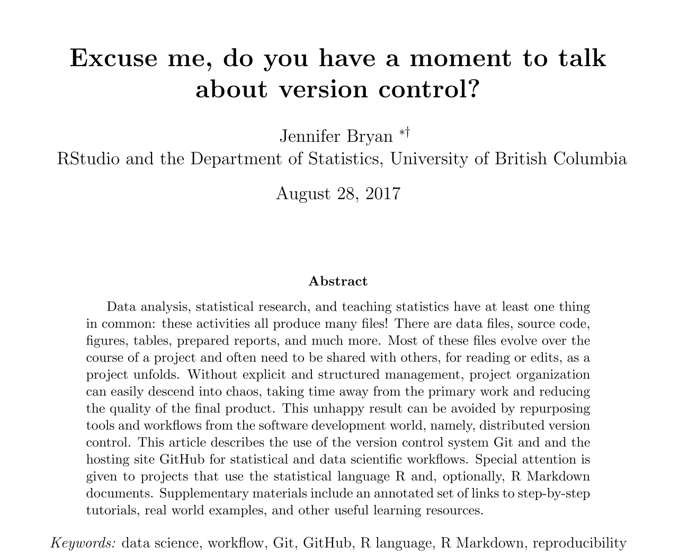
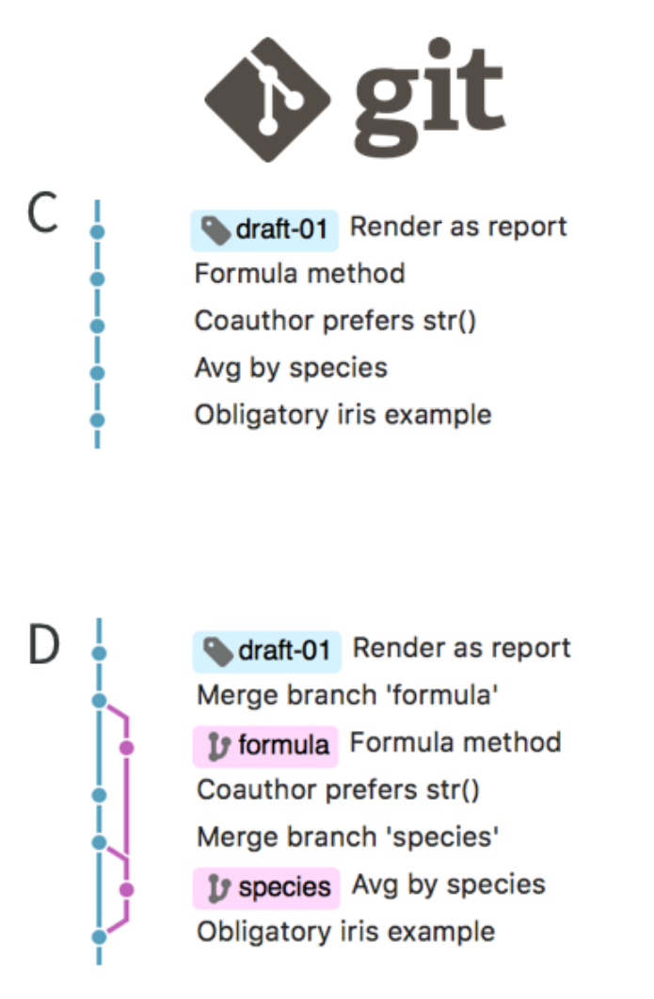

# Overview   
1. Motivations  

2. Version Control  

3. Blogdown   

4. Get Started  

---
# Motivations  

```{r, echo=FALSE, out.width="70%", out.height="70%"}

```
---

# Motivations 

## What can you write on your website? 

---

# Motivations 

## Some potential topics:


- Analyses of datasets that we found are interesting  

- Explanations of concepts in our fields  

- Interesting projects that we have worked on or we are working on  

- Sharing results from these projects, such as abstracts, posters or papers  

- Sharing our experience and what we have learned after attending a meetup or a conference  

- Summary or critique of several literatures surrounding an interesting topic

---

# Motivations 

## Benefits of writing a blog:  
- Practice writing and coding  

- It can help us understand something better  

- Get advices and feedback

- Help others 

- Show your work! 

---

# Version Control  

```{r, echo=FALSE, out.width="70%", out.height="70%"}

```

---

# Version Control  

```{r, echo=FALSE, out.width="40%", out.height="40%"}
knitr::include_graphics("Untitled 2.png")  
```

.footnote[
 Bryan, Jennifer. "Excuse me, do you have a moment to talk about version control?." The American Statistician 72.1 (2018): 20-27.
]

---

# Version Control    

```{r, echo=FALSE, out.width="30%", out.height="30%"}

```

.footnote[
 Bryan, Jennifer. "Excuse me, do you have a moment to talk about version control?." The American Statistician 72.1 (2018): 20-27.
]
---
background-image: url(https://db.yihui.name/images/hex-blogdown.png)
background-position: 95% 2%  

# Blogdown 


---

# Get Started  

  

